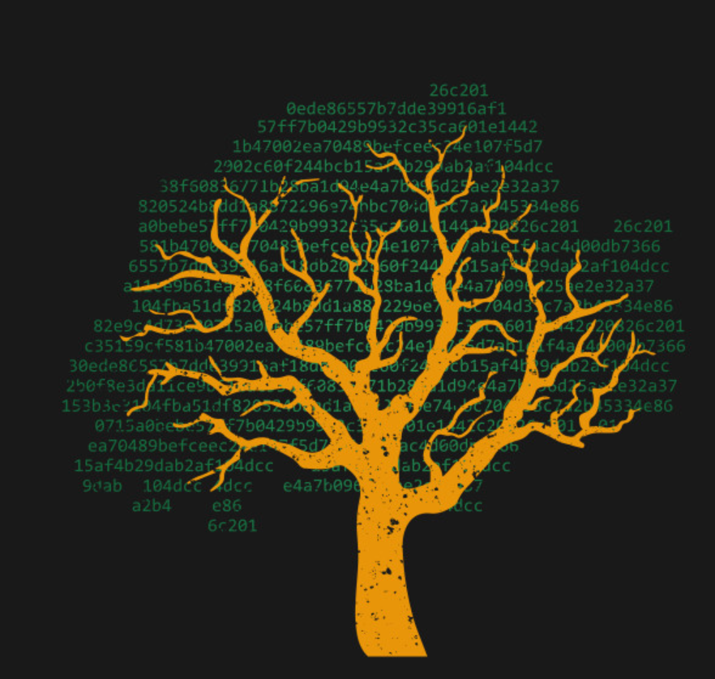

<!-- My first GitHub project! 😄 -->

<!--
**avahluwa/avahluwa** is a ✨ _special_ ✨ repository because its `README.md` (this file) appears on your GitHub profile.

Here are some ideas to get you started:

- 🔭 I’m currently working on ...
- 🌱 I’m currently learning ...
- 👯 I’m looking to collaborate on ...
- 🤔 I’m looking for help with ...
- 💬 Ask me about ...
- 📫 How to reach me: ...
- 😄 Pronouns: ...
- ⚡ Fun fact: ...
-->

# Hi there!!!

### **On GitHub I am:**
 - Utilizing remote repositories to collaborate with others on projects.
 - Leveraging assistance from others in the *Leap Internal Program* to get insight on information that I may not understand and applying that to GitHub.
 - Writing, testing, and troubleshooting code that I have been troubled with.

### **I enjoy:**
 - Learning and challenging myself on new material.
 - Playing videogames (mainly FPS)
 - Working on and driving performance cars.

### **Professional background**
 - **DC Role:** *Senior Datacenter Deployment Technician*
 - I have been learning the *Datacenter Project Manager* role for about a year.
  - I had a brief summer lesson with coding fundamentals in school.

 ---

### **Connect With Me!**
---
 **Email:** aahluwal96@gmail.com

 [My *LinkedIn*](https://www.linkedin.com/in/avi-ahluwalia-76a7b9212/)

